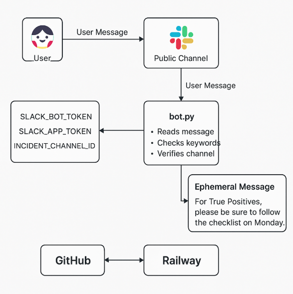

# Python slackbot that reminds users to follow a checklist for certain tasks

At my workplace, we use Slack to track most of our daily operations. In certain situations, we also use a checklist on Monday.com to ensure we complete necessary steps. Due to past instances of people skipping steps, this slack bot returns a reminder to follow the checklist in the event it is required.
---

## Architecture diagram

---

## Stack used:

- Python 3
- Slack Bolt SDK
- Railway (cloud deployment)
- GitHub (version control)

---

## How it works:

1. Slack event trigger- a user posts a message in our designated slack channel
2. Bolt App receives messages, capturing text, user, and channel data
3. Detects our specific keywords that are posted in the Slack channel and verifies it with the channel ID
4. If all conditions are met, the bot sends an ephemeral reminder back to the user- "For True Positives, please be sure to follow the checklist on Monday!"
5. Securely uses tokens via environment variables in Railway cloud
   

